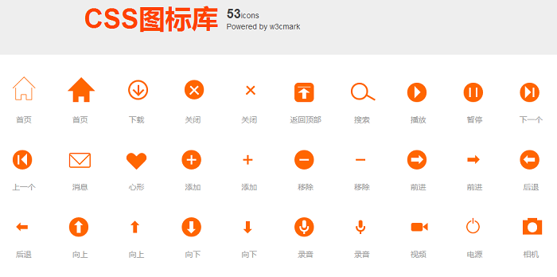

##Less css3icon（持续更新）
  用less写的一些css3 icon，这个叫法有点拗口，通常都是说css3 icon，但是纯粹css3写出的icon大多时候是提供一个icon实现的思路，真正在
项目中遇到时，还是需要花很多时间去调试大小和间距，因为我们知道css实现的icon其实是分很多细微部分图形组合的，间距稍微不协调就很
难看了。
  这时我们就设想，如果只是传入一个值（比如外围宽度）和颜色，就能自由调整整个icon的大小多好啊。这时候就想到less，这个还真可以！
截止到现在，已经实现了53个常用icon。

###Demo截图


###用法
1、下载icon的less文件 ``css/cssicon.less``

2、新建less文件，在头部@import引入cssicon.less文件

3、
写HTML结构，定义icon的样式名，比如房子icon
```
<div class="icon-home-b"></div>
```
写less
```
.icon-home-b{
	.iconHomeb(25px;#f60;0;27px);/*icon外围宽度；icon颜色；icon相对于父级元素的定位*/
}
```

###线上Demo
[Demo在线效果](http://www.w3cmark.com/demo/icon/)
